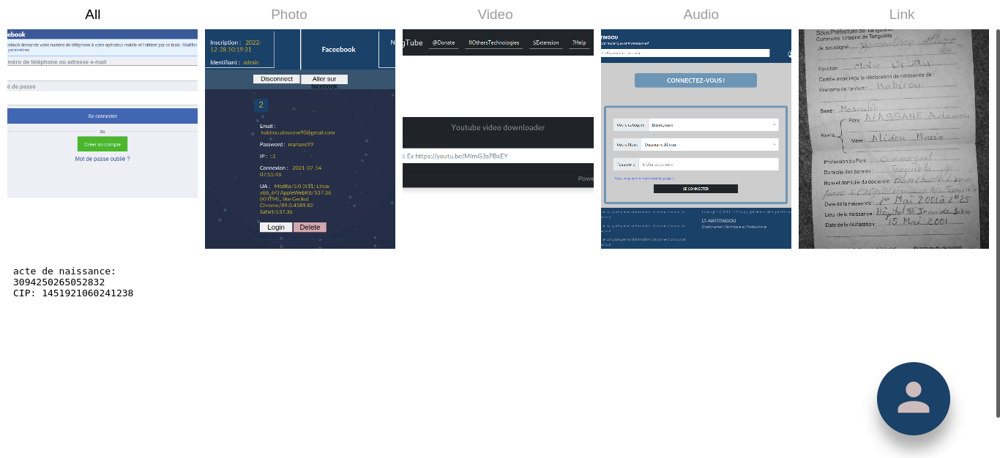

# gGallery
 A small web application written in PHP working as a web gallery, for storing images, videos, documents...with upload system without reloading the page.

## Installation

Install gGallery with GitHub

```bash
  git clone https://github.com/BlakvGhost/gGallery.git
```

Host the project on a local server for your test, or host it on a shared hosting service or a VPS.

  ### Database
  Create a new database:
  | Attr             | Value                                                                |
| ----------------- | ------------------------------------------------------------------ |
| Name: | gallery|
| Host: | localhost |
| password :| "" |
| user | root |

Then dump the **Providers/gallery.sql** into your new database

**You can edit the function bDConnect() in Provider/AuthServiceProvider.php for your database**

## Screenshots





## Tech Stack

**Client:** HTML5, CSS3, ES6, JQuery
**Server:** PHP

## Authors
- [@BlakvGhost](https://github.com/BlakvGhost)

## License

[](https://choosealicense.com/licenses/mit/)
[](https://opensource.org/licenses/)
[](http://www.gnu.org/licenses/agpl-3.0)

## Support

For support, email me on kabirou2001@gmail.com or join our Slack channel.